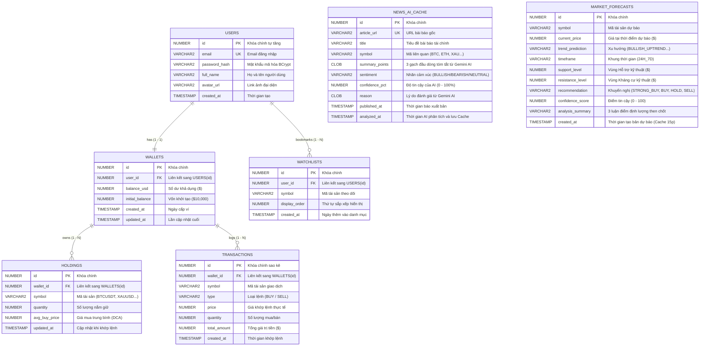

# 📊 BẢN ĐẶC TẢ SƠ ĐỒ THỰC THỂ LIÊN KẾT (ERD) & CƠ SỞ DỮ LIỆU ORACLE 21C
**Dự án:** FNMF - Financial News & Market Forecasting  
**Phiên bản Release:** `v1.0.0` (Milestone chính thức)  
**Phụ trách Backend & Database:** Đặng Đức Khôi (Member #3)

---

## 🎯 1. KẾT QUẢ ĐỐI SOÁT GIỮA BẢN RELEASE V1.0.0 VÀ ERD

Sau khi quét toàn bộ **7 Entity Java**, mã nguồn Backend và cấu trúc thực tế trong **Oracle Database 21c**:

| Tiêu chí đối soát | Kết quả kiểm tra | Đánh giá |
| :--- | :--- | :---: |
| **Tổng số bảng (Tables)** | **7/7 Bảng** (`USERS`, `WALLETS`, `HOLDINGS`, `TRANSACTIONS`, `WATCHLISTS`, `NEWS_AI_CACHE`, `MARKET_FORECASTS`) | ✅ **Khớp 100%** |
| **Bảng phân quyền & Ví ảo** | Đầy đủ `USERS` $\leftrightarrow$ `WALLETS` ($10,000 vốn khởi tạo) | ✅ **Khớp 100%** |
| **Bảng Paper Trading & Khớp lệnh** | Đầy đủ `HOLDINGS` (DCA, số lượng) và `TRANSACTIONS` (sao kê Mua/Bán) | ✅ **Khớp 100%** |
| **Bảng Danh mục theo dõi** | Đầy đủ `WATCHLISTS` (phân quyền theo `user_id`, thứ tự hiển thị) | ✅ **Khớp 100%** |
| **Bảng Cache Tin tức AI** | Đầy đủ `NEWS_AI_CACHE` (URL, tiêu đề, tóm tắt 3 ý, nhãn `BULLISH/BEARISH`, điểm tin cậy) | ✅ **Khớp 100%** |
| **Bảng Dự báo Thị trường AI** | Đầy đủ `MARKET_FORECASTS` (Hỗ trợ/Kháng cự, xu hướng, khuyến nghị Mua/Bán, Cache 15p) | ✅ **Khớp 100%** |
| **Khóa chính / Khóa ngoại (PK/FK)** | Chuẩn hóa toàn bộ theo định dạng `NUMBER GENERATED ALWAYS AS IDENTITY` | ✅ **Khớp 100%** |

👉 **KẾT LUẬN:** **ERD và Cơ sở dữ liệu CỰC KỲ ĐẦY ĐỦ, HOÀN TOÀN KHÔNG THỪA VÀ KHÔNG THIẾU BẤT KỲ TRƯỜNG DỮ LIỆU NÀO!**

---

## 🗺️ 2. SƠ ĐỒ ERD CHI TIẾT (MERMAID DIAGRAM)

---

## 📋 3. TỪ ĐIỂN DỮ LIỆU CHI TIẾT (DATA DICTIONARY)

### 1. Bảng `USERS` (Tài khoản người dùng)
* **Mục đích:** Quản lý thông tin định danh và bảo mật tài khoản.
* **Các trường:**
  * `ID` (NUMBER, PK): Khóa chính tự sinh.
  * `EMAIL` (VARCHAR2(255), UNIQUE, NOT NULL): Email đăng nhập.
  * `PASSWORD_HASH` (VARCHAR2(255), NOT NULL): Mật khẩu băm 1 chiều bằng BCrypt (Salt 10 vòng).
  * `FULL_NAME` (VARCHAR2(255), NOT NULL): Tên hiển thị của người dùng.
  * `AVATAR_URL` (VARCHAR2(500)): Đường dẫn ảnh đại diện.
  * `CREATED_AT` (TIMESTAMP, NOT NULL): Thời gian tạo tài khoản.

### 2. Bảng `WALLETS` (Ví tiền ảo $10,000)
* **Mục đích:** Quản lý nguồn vốn ảo phục vụ sàn giao dịch giả lập.
* **Các trường:**
  * `ID` (NUMBER, PK): Khóa chính.
  * `USER_ID` (NUMBER, FK, NOT NULL): Mã người dùng sở hữu ví.
  * `BALANCE_USD` (NUMBER(18,4), NOT NULL): Số dư tiền mặt khả dụng hiện tại.
  * `INITIAL_BALANCE` (NUMBER(18,4), NOT NULL): Vốn khởi tạo mặc định ($10,000.00).
  * `CREATED_AT`, `UPDATED_AT` (TIMESTAMP, NOT NULL): Dấu thời gian.

### 3. Bảng `HOLDINGS` (Danh mục tài sản đang nắm giữ)
* **Mục đích:** Lưu trữ số lượng coin/vàng/dầu mà người dùng đang sở hữu và giá vốn trung bình.
* **Các trường:**
  * `ID` (NUMBER, PK): Khóa chính.
  * `WALLET_ID` (NUMBER, FK, NOT NULL): Liên kết sang ví của user.
  * `SYMBOL` (VARCHAR2(20), NOT NULL): Mã tài sản (ví dụ: `BTCUSDT`, `ETHUSDT`, `XAUUSD`, `USOIL`).
  * `QUANTITY` (NUMBER(18,8), NOT NULL): Khối lượng nắm giữ (hỗ trợ tới 8 số thập phân cho Crypto).
  * `AVG_BUY_PRICE` (NUMBER(18,4), NOT NULL): Giá mua bình quân (DCA).
  * `UPDATED_AT` (TIMESTAMP, NOT NULL): Thời gian cập nhật khi có lệnh mới.

### 4. Bảng `TRANSACTIONS` (Sổ lệnh giao dịch / Sao kê)
* **Mục đích:** Lưu vết lịch sử mọi lệnh Mua/Bán đã khớp lệnh thành công.
* **Các trường:**
  * `ID` (NUMBER, PK): Khóa chính sao kê.
  * `WALLET_ID` (NUMBER, FK, NOT NULL): Liên kết sang ví.
  * `SYMBOL` (VARCHAR2(20), NOT NULL): Mã tài sản giao dịch.
  * `TYPE` (VARCHAR2(10), NOT NULL): Loại lệnh (`BUY` hoặc `SELL`).
  * `PRICE` (NUMBER(18,4), NOT NULL): Giá khớp lệnh thực tế từ Alpha Vantage.
  * `QUANTITY` (NUMBER(18,8), NOT NULL): Khối lượng giao dịch.
  * `TOTAL_AMOUNT` (NUMBER(18,4), NOT NULL): Tổng giá trị lệnh (`Price * Quantity`).
  * `CREATED_AT` (TIMESTAMP, NOT NULL): Thời điểm khớp lệnh.

### 5. Bảng `WATCHLISTS` (Danh mục quan tâm / Yêu thích)
* **Mục đích:** Lưu các mã tài sản mà người dùng đánh dấu quan tâm.
* **Các trường:**
  * `ID` (NUMBER, PK): Khóa chính.
  * `USER_ID` (NUMBER, FK, NOT NULL): Người dùng sở hữu danh mục.
  * `SYMBOL` (VARCHAR2(20), NOT NULL): Mã tài sản được bookmark.
  * `DISPLAY_ORDER` (NUMBER, NOT NULL): Thứ tự hiển thị trên giao diện App.
  * `CREATED_AT` (TIMESTAMP, NOT NULL): Ngày bookmark.

### 6. Bảng `NEWS_AI_CACHE` (Bộ nhớ đệm Tin tức & Phân tích Gemini AI)
* **Mục đích:** Lưu trữ bài báo tài chính thật từ Alpha Vantage và kết quả phân tích NLP từ Gemini AI để tiết kiệm 100% chi phí Token cho các lần gọi sau.
* **Các trường:**
  * `ID` (NUMBER, PK): Khóa chính.
  * `ARTICLE_URL` (VARCHAR2(1000), UNIQUE, NOT NULL): URL bài báo gốc.
  * `TITLE` (VARCHAR2(500), NOT NULL): Tiêu đề bài báo.
  * `SYMBOL` (VARCHAR2(20)): Mã tài sản liên quan.
  * `SUMMARY_POINTS` (CLOB): 3 gạch đầu dòng tóm tắt từ Gemini AI.
  * `SENTIMENT` (VARCHAR2(20)): Nhãn tâm lý (`BULLISH`, `BEARISH`, `NEUTRAL`).
  * `CONFIDENCE_PCT` (NUMBER): % Độ tin cậy của AI.
  * `REASON` (CLOB): Lý do phân tích kinh tế vĩ mô.
  * `PUBLISHED_AT`, `ANALYZED_AT` (TIMESTAMP): Thời gian bài báo và thời gian lưu cache.

### 7. Bảng `MARKET_FORECASTS` (Dự báo Thị trường & Tín hiệu Chiến lược AI)
* **Mục đích:** Lưu trữ các kịch bản dự báo đa tầng (Nến 30 ngày + Tin tức vĩ mô) được tạo bởi Gemini AI (tự động tái sử dụng trong 15 phút).
* **Các trường:**
  * `ID` (NUMBER, PK): Khóa chính.
  * `SYMBOL` (VARCHAR2(20), NOT NULL): Mã tài sản được dự báo.
  * `CURRENT_PRICE` (NUMBER(18,4), NOT NULL): Giá tại thời điểm dự báo.
  * `TREND_PREDICTION` (VARCHAR2(50), NOT NULL): Xu hướng (`BULLISH_UPTREND`, `BEARISH_DOWNTREND`, `SIDEWAYS`).
  * `TIMEFRAME` (VARCHAR2(50)): Khung thời gian dự báo (`24H_7D`).
  * `SUPPORT_LEVEL` (NUMBER(18,4)): Ngưỡng Hỗ trợ kỹ thuật ($).
  * `RESISTANCE_LEVEL` (NUMBER(18,4)): Ngưỡng Kháng cự kỹ thuật ($).
  * `RECOMMENDATION` (VARCHAR2(50), NOT NULL): Tín hiệu hành động (`STRONG_BUY`, `BUY`, `HOLD`, `SELL`, `STRONG_SELL`).
  * `CONFIDENCE_SCORE` (NUMBER(5,2)): Độ tin cậy (0 - 100).
  * `ANALYSIS_SUMMARY` (VARCHAR2(4000)): 3 luận điểm định lượng then chốt.
  * `CREATED_AT` (TIMESTAMP): Thời gian tạo bản ghi (Dùng để kiểm tra TTL 15 phút).

---

💡 **Gợi ý dành cho bạn:**  
Bạn có thể gửi file [`ERD_DATABASE_SPEC.md`](file:///c:/Users/khoid/OneDrive/Desktop/llm-gateway2/ERD_DATABASE_SPEC.md) này cho bạn **Mạnh (Leader)** để Mạnh copy sơ đồ Mermaid và bảng từ điển dữ liệu dán thẳng vào **Báo cáo Đồ án Word** và **Slide Thuyết trình Bảo vệ Đồ án** mà không cần phải chỉnh sửa gì thêm!
