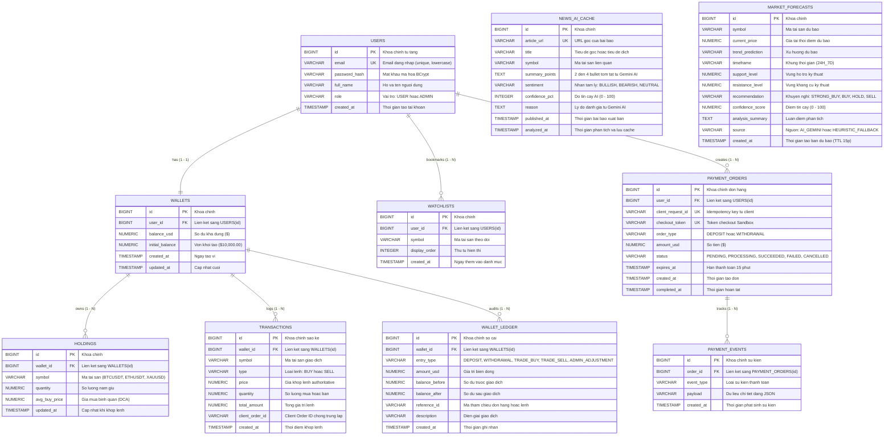

# BAN DAC TA SO DO THUC THE LIEN KET (ERD) & CO SO DU LIEU POSTGRESQL (FLYWAY V1 - V8)
Du an: FNMF - Financial News & Market Forecasting
Phien ban: v1.1.18
Phu trach Backend & Database: Dang Duc Khoi (Member #3)

---

## 1. TONG QUAN CO SO DU LIEU VA MIGRATION FLYWAY

Co so du lieu tren Production su dung PostgreSQL tren Railway, duoc quan ly phien ban tap trung thong qua 8 ban migration Flyway (V1 den V8):
- `V1__init_schema.sql`: Khoi tao cac bang nguoi dung, vi von, danh muc nam giu, giao dich, watchlist, cache tin tuc va du bao thi truong.
- `V2__normalize_and_enforce_user_email.sql`: Chuan hoa mo hinh dang nhap email-only va rang buoc duy nhat `LOWER(email)`.
- `V3__holding_unique_constraint_and_client_order_id.sql`: Rang buoc duy nhat `(WALLET_ID, SYMBOL)` chong nhan doi tai san va cot `CLIENT_ORDER_ID` chong trung lap lenh dong thoi.
- `V4__add_payment_orders_and_checkout_token.sql`: Khoi tao bang `PAYMENT_ORDERS` va checkout token co han 15 phut.
- `V5__add_wallet_ledger_audit.sql`: Khoi tao bang so cai bien dong so du don bat bien `WALLET_LEDGER`.
- `V6__add_payment_events_and_scale_guards.sql`: Khoi tao bang luu vet su kien thanh toan `PAYMENT_EVENTS` va kiem soat scale so tien.
- `V7__harden_payment_flow_and_order_indexes.sql`: Bo sung chi muc va kiem soat het han cho giao dich payment.
- `V8__add_forecast_source_and_metadata.sql`: Bo sung cot phan loai nguon du bao (`source`), metadata phan tich va chat luong du bao.

Tong so bang trong he thong: 10 bang (`USERS`, `WALLETS`, `HOLDINGS`, `TRANSACTIONS`, `WATCHLISTS`, `NEWS_AI_CACHE`, `MARKET_FORECASTS`, `PAYMENT_ORDERS`, `WALLET_LEDGER`, `PAYMENT_EVENTS`).

---

## 2. SO DO ERD CHI TIET (MERMAID DIAGRAM)

---

## 3. TU DIEN DU LIEU CHI TIET (DATA DICTIONARY)

### 1. Bang USERS
* Muc dich: Quan ly danh tinh nguoi dung email-only va phan quyen.
* Cac cot:
  * `id` (BIGINT, PK, Identity): Khoa chinh tu tang.
  * `email` (VARCHAR(255), UNIQUE, NOT NULL): Dia chi email (duoc chuan hoa chu thuong).
  * `password_hash` (VARCHAR(255), NOT NULL): Mat khau bam bang BCrypt (salt 10 vong).
  * `full_name` (VARCHAR(255), NOT NULL): Ho ten nguoi dung.
  * `role` (VARCHAR(50), NOT NULL, DEFAULT 'USER'): Vai tro nguoi dung (`USER`, `ADMIN`).
  * `created_at` (TIMESTAMP, NOT NULL): Thoi diem dang ky.

### 2. Bang WALLETS
* Muc dich: Quan ly so du von ao phuc vu giao dich Paper Trading va Sandbox Banking.
* Cac cot:
  * `id` (BIGINT, PK, Identity): Khoa chinh vi.
  * `user_id` (BIGINT, FK, UNIQUE, NOT NULL): Lien ket toi `USERS(id)`.
  * `balance_usd` (NUMERIC(19,4), NOT NULL): So du tien mat kha dung.
  * `initial_balance` (NUMERIC(19,4), NOT NULL): Von khoi tao ($10,000.00).
  * `created_at` (TIMESTAMP, NOT NULL): Thoi diem cap vi.
  * `updated_at` (TIMESTAMP, NOT NULL): Thoi diem cap nhat so du cuoi cung.

### 3. Bang HOLDINGS
* Muc dich: Luu tru khoi luong va gia von trung binh (DCA) cac ma tai san dang nam giu.
* Rang buoc duy nhat: `UNIQUE (wallet_id, symbol)` ngan chan nhan doi dong tai san.
* Cac cot:
  * `id` (BIGINT, PK, Identity): Khoa chinh.
  * `wallet_id` (BIGINT, FK, NOT NULL): Lien ket toi `WALLETS(id)`.
  * `symbol` (VARCHAR(20), NOT NULL): Ma tai san (`BTCUSDT`, `ETHUSDT`, `XAUUSD`).
  * `quantity` (NUMERIC(19,8), NOT NULL): So luong nam giu (do chinh xac toi 8 so le).
  * `avg_buy_price` (NUMERIC(19,4), NOT NULL): Gia mua binh quan (DCA).
  * `updated_at` (TIMESTAMP, NOT NULL): Thoi diem cap nhat khi co lenh khop.

### 4. Bang TRANSACTIONS
* Muc dich: So nhat ky khop lenh Paper Trading thoi gian thuc.
* Cac cot:
  * `id` (BIGINT, PK, Identity): Khoa chinh giao dich.
  * `wallet_id` (BIGINT, FK, NOT NULL): Lien ket toi `WALLETS(id)`.
  * `symbol` (VARCHAR(20), NOT NULL): Ma tai san.
  * `type` (VARCHAR(10), NOT NULL): Loai lenh (`BUY` hoac `SELL`).
  * `price` (NUMERIC(19,4), NOT NULL): Gia khop authoritative tu backend.
  * `quantity` (NUMERIC(19,8), NOT NULL): So luong khop lenh.
  * `total_amount` (NUMERIC(19,4), NOT NULL): Tong gia tri khop lenh.
  * `client_order_id` (VARCHAR(100)): Idempotency key phia client gui len.
  * `created_at` (TIMESTAMP, NOT NULL): Thoi diem khop lenh.

### 5. Bang WATCHLISTS
* Muc dich: Danh muc theo doi tai san cua tung nguoi dung.
* Rang buoc: Phan tach doc lap theo `user_id`.
* Cac cot:
  * `id` (BIGINT, PK, Identity): Khoa chinh.
  * `user_id` (BIGINT, FK, NOT NULL): Lien ket toi `USERS(id)`.
  * `symbol` (VARCHAR(20), NOT NULL): Ma tai san theo doi.
  * `display_order` (INTEGER, NOT NULL, DEFAULT 0): Thu tu sap xep hien thi.
  * `created_at` (TIMESTAMP, NOT NULL): Ngay them vao watchlist.

### 6. Bang NEWS_AI_CACHE
* Muc dich: Bo nho dem luu tru tin tuc tai chinh va ket qua phan tich tu Gemini AI de tiet kiem quota va giam do tre.
* Cac cot:
  * `id` (BIGINT, PK, Identity): Khoa chinh.
  * `article_url` (VARCHAR(1000), UNIQUE, NOT NULL): URL goc bai bao (dung lam khoa cache).
  * `title` (VARCHAR(500), NOT NULL): Tieu de bai bao (dich sang tieng Viet).
  * `symbol` (VARCHAR(20)): Ma tai san lien quan.
  * `summary_points` (TEXT): 2 den 4 bullet tom tat tieng Viet tu Gemini AI.
  * `sentiment` (VARCHAR(20)): Nhan cam xuc (`BULLISH`, `BEARISH`, `NEUTRAL`).
  * `confidence_pct` (INTEGER): Do tin cay AI (0 - 100).
  * `reason` (TEXT): Ly do phan tich tu Gemini AI.
  * `published_at` (TIMESTAMP): Thoi diem bai bao xuat ban.
  * `analyzed_at` (TIMESTAMP): Thoi diem AI phan tich va ghi cache.

### 7. Bang MARKET_FORECASTS
* Muc dich: Luu tru cac ban du bao xu huong va tin hieu giao dich tao boi Gemini AI (TTL 15 phut).
* Cac cot:
  * `id` (BIGINT, PK, Identity): Khoa chinh.
  * `symbol` (VARCHAR(20), NOT NULL): Ma tai san du bao.
  * `current_price` (NUMERIC(19,4), NOT NULL): Gia tai thoi diem du bao.
  * `trend_prediction` (VARCHAR(50), NOT NULL): Xu huong du bao.
  * `timeframe` (VARCHAR(50)): Khung thoi gian (`24H_7D`).
  * `support_level` (NUMERIC(19,4)): Vung ho tro ky thuat.
  * `resistance_level` (NUMERIC(19,4)): Vung khang cu ky thuat.
  * `recommendation` (VARCHAR(50), NOT NULL): Khuyen nghi (`STRONG_BUY`, `BUY`, `HOLD`, `SELL`).
  * `confidence_score` (NUMERIC(5,2)): Diem tin cay (0 - 100).
  * `analysis_summary` (TEXT): Luan diem phan tich.
  * `source` (VARCHAR(50), DEFAULT 'AI_GEMINI'): Nguon du bao (`AI_GEMINI` hoac `HEURISTIC_FALLBACK`).
  * `created_at` (TIMESTAMP, NOT NULL): Thoi diem tao ban du bao.

### 8. Bang PAYMENT_ORDERS
* Muc dich: Quan ly don hang nap/rut tien Sandbox, phuc vu mo phong cong thanh toan hosted.
* Cac cot:
  * `id` (BIGINT, PK, Identity): Khoa chinh don hang.
  * `user_id` (BIGINT, FK, NOT NULL): Lien ket toi `USERS(id)`.
  * `client_request_id` (VARCHAR(100), UNIQUE, NOT NULL): Idempotency key chong trung lap yeu cau.
  * `checkout_token` (VARCHAR(100), UNIQUE): Token truy cap giao dien hosted checkout.
  * `order_type` (VARCHAR(20), NOT NULL): Loai don (`DEPOSIT` hoac `WITHDRAWAL`).
  * `amount_usd` (NUMERIC(19,2), NOT NULL): So tien giao dich (scale toi da 2 so le).
  * `status` (VARCHAR(20), NOT NULL): Trang thai (`PENDING`, `PROCESSING`, `SUCCEEDED`, `FAILED`, `CANCELLED`).
  * `expires_at` (TIMESTAMP, NOT NULL): Han thanh toan (khoi tao +15 phut; qua han tra ve HTTP 410).
  * `created_at` (TIMESTAMP, NOT NULL): Thoi diem khoi tao don.
  * `completed_at` (TIMESTAMP): Thoi diem hoan tat giao dich.

### 9. Bang WALLET_LEDGER
* Muc dich: So cai bien dong so du don (single-entry append-only ledger) luu tru bat bien moi thay doi so du vi.
* Cac cot:
  * `id` (BIGINT, PK, Identity): Khoa chinh so cai.
  * `wallet_id` (BIGINT, FK, NOT NULL): Lien ket toi `WALLETS(id)`.
  * `entry_type` (VARCHAR(30), NOT NULL): Loai bien dong (`DEPOSIT`, `WITHDRAWAL`, `TRADE_BUY`, `TRADE_SELL`, `ADMIN_ADJUSTMENT`).
  * `amount_usd` (NUMERIC(19,4), NOT NULL): So tien bien dong.
  * `balance_before` (NUMERIC(19,4), NOT NULL): So du truoc giao dich.
  * `balance_after` (NUMERIC(19,4), NOT NULL): So du sau giao dich.
  * `reference_id` (VARCHAR(100)): Ma tham chieu don hang hoac lenh giao dich.
  * `description` (VARCHAR(255)): Mo ta chi tiet ve giao dich.
  * `created_at` (TIMESTAMP, NOT NULL): Thoi diem ghi so.

### 10. Bang PAYMENT_EVENTS
* Muc dich: Nhat ky ghi nhan cac su kien vong doi cua don hang nap rut phuc vu kiem toan va bao dam tinh luy thua.
* Cac cot:
  * `id` (BIGINT, PK, Identity): Khoa chinh su kien.
  * `order_id` (BIGINT, FK, NOT NULL): Lien ket toi `PAYMENT_ORDERS(id)`.
  * `event_type` (VARCHAR(50), NOT NULL): Loai su kien (`ORDER_CREATED`, `CHECKOUT_VISITED`, `PAYMENT_PROCESSED`, `ORDER_CANCELLED`, `ORDER_EXPIRED`).
  * `payload` (TEXT): Du lieu chi tiet su kien dang JSON.
  * `created_at` (TIMESTAMP, NOT NULL): Thoi diem ghi nhan su kien.
