# FNMF Codebase Walkthrough — Draft

> Trạng thái: bản nháp phục vụ học code, chuẩn bị báo cáo và bảo vệ đồ án. Tài liệu mô tả code tại backend commit `c6fc16c` và Android commit `5bc7f7d`. Các ảnh bên dưới được sinh trực tiếp từ source tương ứng để người đọc có thể đối chiếu.

## 1. Mục tiêu tài liệu

Tài liệu này không chỉ liệt kê tính năng. Mỗi phần lần theo một luồng hoàn chỉnh:

1. Người dùng thực hiện thao tác gì trên Android.
2. Android gọi endpoint nào.
3. Controller và service nào xử lý request.
4. Dữ liệu đến từ API ngoài hay database nào.
5. Dữ liệu được biến đổi, lưu và trả về ra sao.
6. Hệ thống phản ứng thế nào khi một thành phần gặp lỗi.

Đối tượng đọc là thành viên nhóm cần nắm codebase, giảng viên phản biện luồng hệ thống, hoặc người học muốn dùng dự án như một case study Android–Spring Boot–Cloud.

## 2. Kiến trúc tổng thể

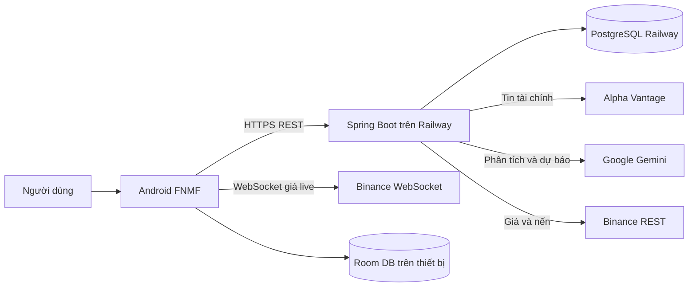

Android mặc định gọi domain Railway thay cho IP LAN. URL được quản lý tập trung trong `NetworkConfig`, sau đó được dùng để xây dựng Retrofit client.

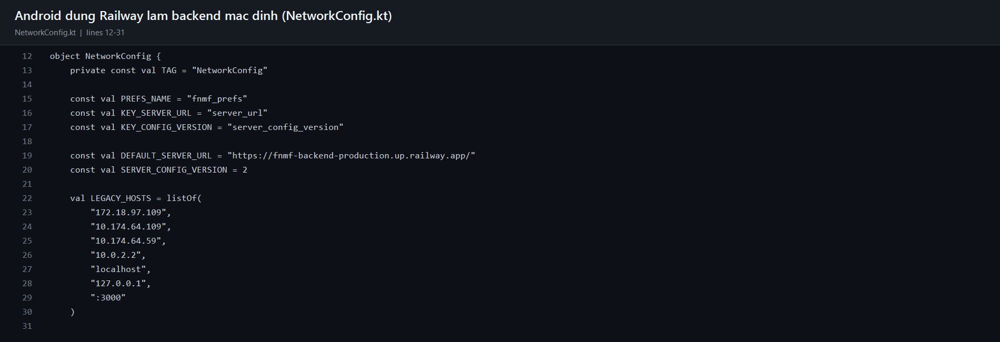

### 2.1. Cloud khác gì với chạy từ IntelliJ và hotspot?

Khi chạy từ IntelliJ, Spring Boot vẫn là backend thật nhưng tiến trình Java nằm trên laptop. Điện thoại phải truy cập IP LAN của laptop, thường phải cùng Wi-Fi hoặc hotspot. Laptop tắt, JVM dừng hoặc IP thay đổi thì điện thoại không thể gọi backend. `localhost` trên điện thoại là chính điện thoại, không phải laptop.

Trên Railway, Spring Boot được build thành container và chạy trên máy chủ từ xa. Railway cấp domain HTTPS công khai, truyền `PORT` cho ứng dụng và kết nối tới PostgreSQL bằng biến môi trường. Do đó thiết bị không cần cùng mạng với laptop.

| Môi trường | Backend | Database | Phạm vi truy cập |
|---|---|---|---|
| Local | JVM do IntelliJ/JAR khởi chạy | H2 file | Laptop và thiết bị cùng LAN |
| Production | Container Railway | PostgreSQL Railway | Internet qua HTTPS |

Production đọc cấu hình từ `application-prod.properties`; API key và mật khẩu database không nằm trong APK hoặc source public.

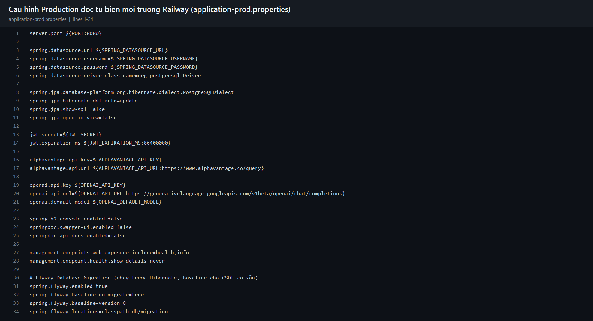

## 3. Flow News

### 3.1. Android yêu cầu danh sách News

Khi `NewsFeedFragment` xuất hiện, coroutine gọi `NewsApiService.syncNews()`. Retrofit gửi `GET /api/news/sync` tới base URL Railway. Khi thành công, trường `data` trong response được đưa vào adapter; khi thất bại, UI hiển thị trạng thái lỗi thay vì tự đọc mock asset.

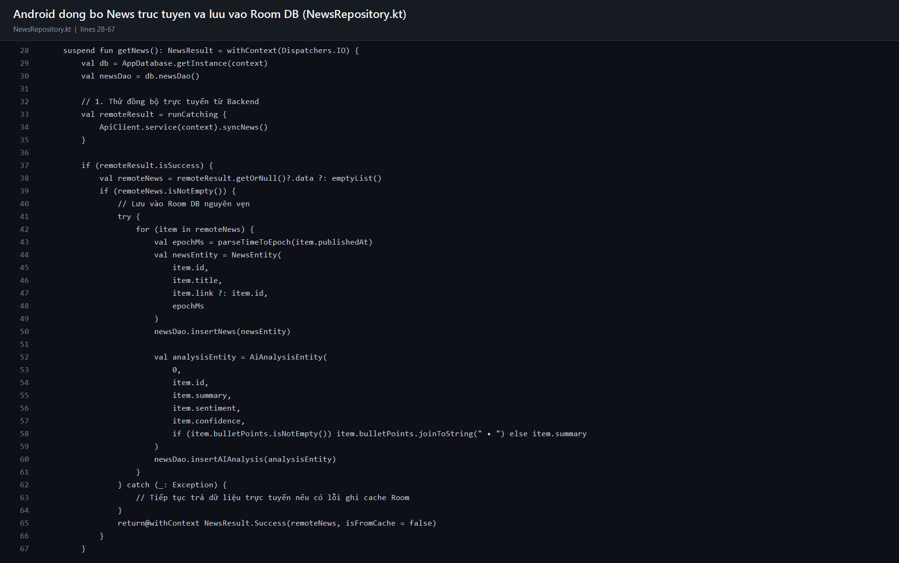

Flow rút gọn:

```text
NewsFeedFragment
  -> ApiClient / NewsApiService
  -> GET /api/news/sync
  -> NewsAiController
  -> AiNewsService.getLiveAiNewsFeed(...)
```

### 3.2. Backend lấy tin từ Alpha Vantage

`AiNewsService` dựng URL Alpha Vantage với `function=NEWS_SENTIMENT`, bộ lọc ticker/topic, `limit` và API key. Đây là REST request thông thường; Alpha Vantage không nhận prompt AI.

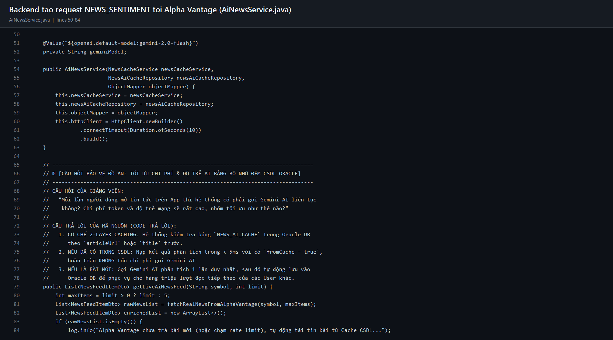

Response Alpha Vantage chứa các trường như `title`, `url`, `time_published`, `summary`, `source` và sentiment gốc. Backend ánh xạ chúng thành DTO nội bộ trước khi phân tích tiếp.

### 3.3. Kiểm tra cache trước khi gọi Gemini

Mỗi bài được nhận diện chủ yếu bằng URL. Nếu bài đã có trong bảng `NEWS_AI_CACHE`, backend dùng kết quả cũ. Nếu chưa có, backend tạo `NewsAnalysisRequest`, gọi Gemini và lưu kết quả mới vào PostgreSQL.

Mục đích của cache:

- Không trả tiền phân tích lại cùng một bài.
- Giảm số request và thời gian phản hồi.
- Có dữ liệu dự phòng khi Alpha Vantage chạm rate limit.
- Giữ cùng một kết quả phân tích giữa nhiều thiết bị.

### 3.4. Gemini nhận prompt nào?

System prompt News được hardcode trong `AiNewsService`. Prompt quy định vai trò chuyên gia, yêu cầu ba gạch đầu dòng, nhãn `BULLISH/BEARISH/NEUTRAL`, confidence, reason và bắt buộc trả JSON.

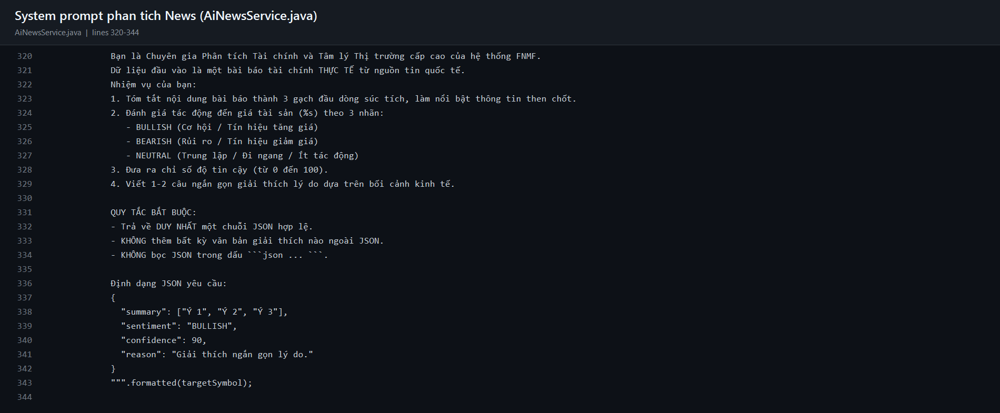

User prompt chứa tiêu đề và nội dung tóm tắt lấy từ Alpha Vantage. Backend gửi system/user message tới endpoint Gemini tương thích OpenAI, với model lấy từ cấu hình và `temperature = 0.2`.

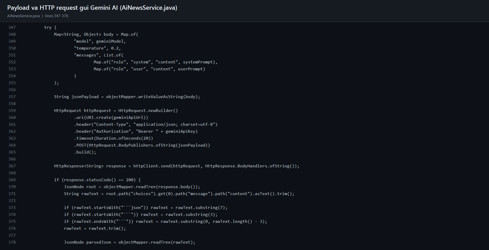

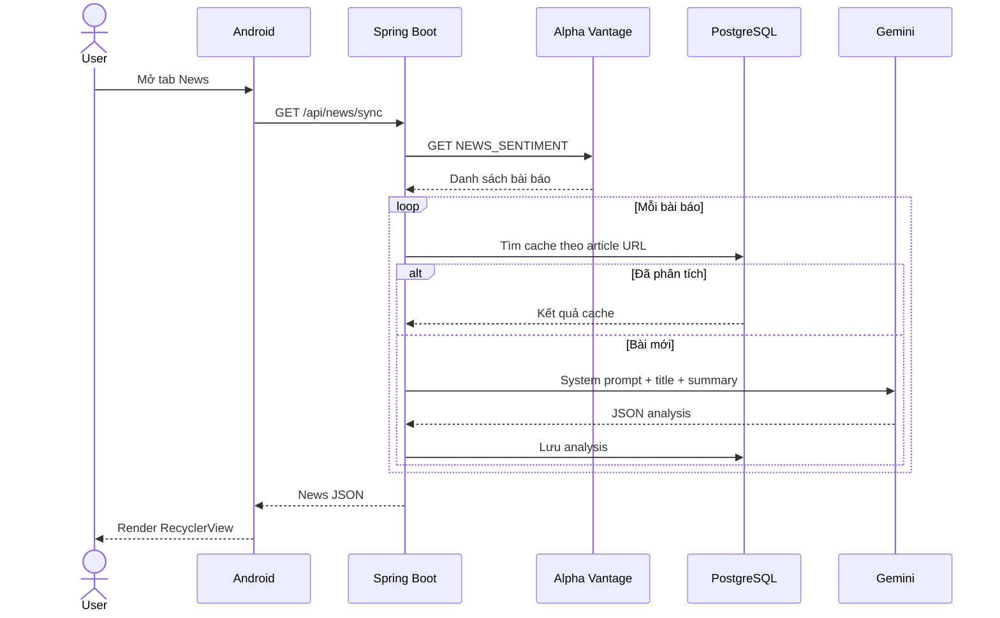

### 3.5. Các nhánh lỗi của News

- Alpha Vantage lỗi hoặc hết quota: đọc cache PostgreSQL.
- Gemini chưa có key hoặc request lỗi: chạy heuristic dựa trên từ khóa.
- Không có live news lẫn cache: trả danh sách rỗng để Android hiển thị empty state.
- JSON Gemini sai định dạng: parser bắt lỗi và chuyển sang heuristic.

Điểm cần cải tiến: response hiện nên bổ sung `analysisSource = GEMINI | HEURISTIC | CACHE` để UI không trình bày kết quả heuristic như thể chắc chắn do Gemini tạo.

## 4. Flow Market Data và biểu đồ nến

### 4.1. Nến lịch sử

Android gọi `GET /api/market/candles?symbol=...&interval=daily`. Backend hiện lấy 30 nến ngày từ Binance REST endpoint `/api/v3/klines`. Dữ liệu OHLCV được ánh xạ thành `CandleDto` rồi vẽ bằng MPAndroidChart.

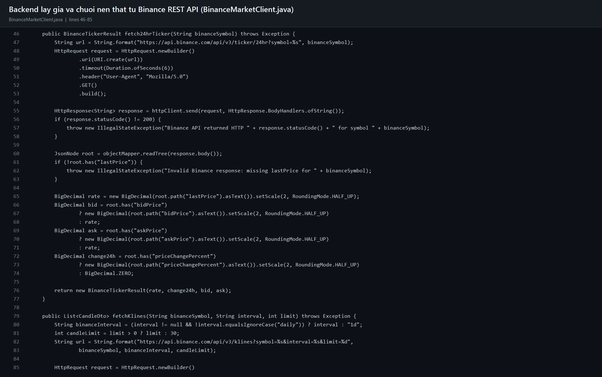

### 4.2. Tick giá live

Màn hình Trading mở WebSocket trực tiếp tới Binance. Mỗi message kline 1 giây cập nhật giá/header và cây nến đang hoạt động. BTC và ETH dùng cặp USDT; XAU dùng PAXG như tài sản tham chiếu. Mã không được hỗ trợ không được phép fallback sang stream BTC ở Android v1.1.13.

Lý do dùng WebSocket: server có thể đẩy tick liên tục trên một kết nối, thay vì app gửi REST request lặp lại mỗi giây.

### 4.3. Nguồn sự thật và cache

- Giá hiển thị live: Binance WebSocket trên Android.
- Nến lịch sử: Binance REST qua backend.
- Giá dùng để khớp lệnh: backend tự lấy, không tin giá do client gửi.
- Room DB: cache cục bộ, không phải nguồn sự thật của ví hay giao dịch.

## 5. Flow đặt lệnh Paper Trading

Android chỉ gửi `symbol`, `side` và `quantity`, kèm JWT. `TradeController` lấy user ID từ token và yêu cầu `MarketDataService` lấy giá hiện tại. `TradeService.executeOrder()` chạy trong transaction: kiểm tra tiền/holding, cập nhật ví, cập nhật holding và ghi lịch sử giao dịch.

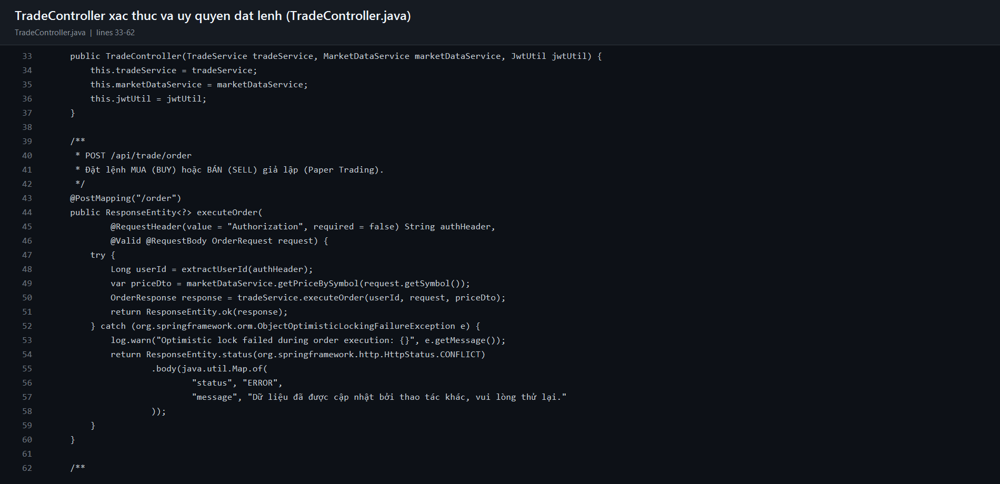

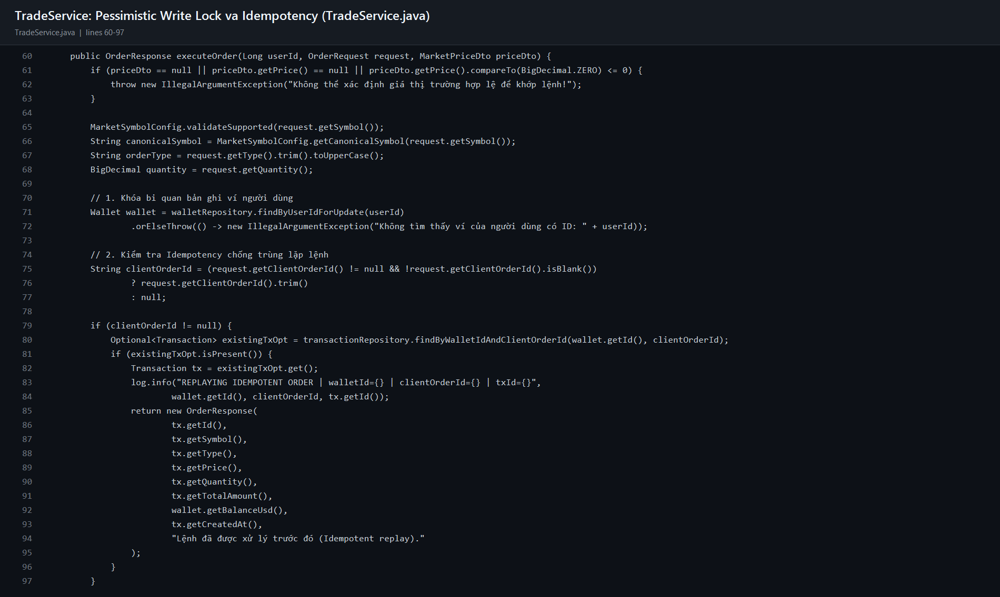

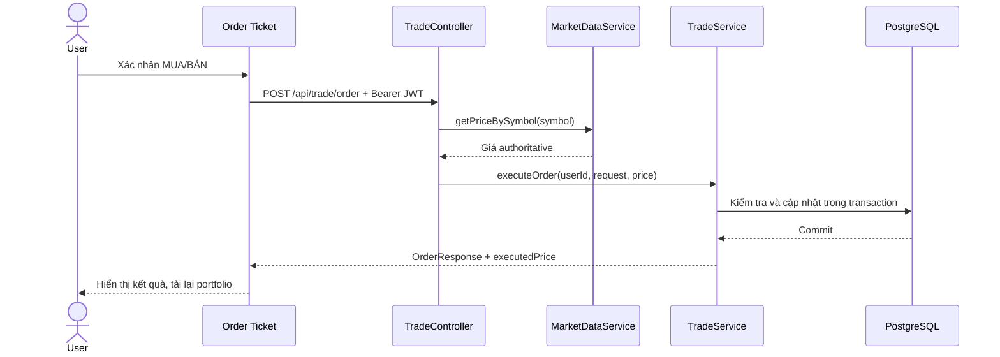

Backend là nơi quyết định giá khớp và kiểm tra số dư. Điều này ngăn client giả mạo giá giao dịch.

## 6. Flow xác thực và quản trị

### 6.1. Người dùng Android

1. Người dùng nhập email và password.
2. Android gọi `/api/auth/login`.
3. Backend kiểm tra password hash BCrypt.
4. Backend phát JWT chứa danh tính/quyền.
5. Android gửi JWT trong `Authorization: Bearer ...` cho portfolio, history và order.

### 6.2. Cloud Admin

`admin.html` là static resource do cùng Spring Boot phục vụ. Admin đăng nhập để nhận JWT có role `ADMIN`, sau đó gọi `/api/admin/db/overview` và `/api/admin/set-balance`. Thao tác thay đổi PostgreSQL cloud, không thay đổi file H2 trên laptop.

Production cố ý tắt H2 Console, Swagger và raw SQL admin endpoint để giảm bề mặt tấn công.

## 7. Flow Forecast AI

Thiết kế dự kiến của backend:

```text
symbol + timeframe
  -> giá hiện tại
  -> nến gần nhất
  -> news cache gần nhất
  -> ghép thành user prompt
  -> Gemini
  -> trend/support/resistance/recommendation/confidence
  -> lưu MARKET_FORECASTS
```

System prompt forecast được hardcode trong `ForecastService`. Nó yêu cầu Gemini kết hợp dữ liệu kỹ thuật và tâm lý tin tức, sau đó chỉ trả JSON.

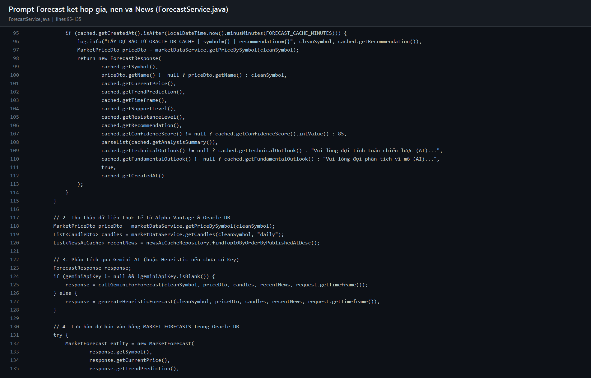

## 8. Database và migration

Local dùng H2 để chạy nhanh, ít cấu hình. Production dùng PostgreSQL để nhiều client truy cập đồng thời và để dữ liệu tồn tại độc lập với container.

Flyway chạy migration có version trước khi Hibernate tạo `EntityManagerFactory`. Ví dụ migration role thực hiện theo thứ tự: thêm cột nullable, backfill user cũ, đặt default rồi mới thêm ràng buộc `NOT NULL`.

Các nhóm dữ liệu chính:

- `USERS`: tài khoản và role.
- `WALLETS`: tiền mặt, vốn ban đầu.
- `HOLDINGS`: tài sản đang nắm giữ.
- `TRANSACTIONS`: lệnh đã thực thi.
- `NEWS_AI_CACHE`: bài báo và kết quả phân tích.
- `MARKET_FORECASTS`: lịch sử dự báo.

## 9. Đánh giá Known Issues & Bằng chứng Kiểm thử (Correctness Phase)

Toàn bộ các lỗi nghiêm trọng về tính đúng đắn dữ liệu và hợp đồng API đã được xử lý triệt để trong Correctness & Data-Integrity Phase:

### 9.1. [ĐÃ XỬ LÝ] Hợp đồng API Forecast (Contract Alignment)
- **Trước đây:** Android khai báo sai `GET /api/forecast/predict?symbol=...`, gây lỗi 404 khi truy vấn từ App.
- **Giải pháp:** Cập nhật `ApiService.kt` thành `@GET("/api/forecast/{symbol}")` với `@Path("symbol")` và `@Query("timeframe") = "24H_7D"`. `ForecastFragment` bổ sung quản lý vòng đời (hủy call khi `onDestroyView`), hiển thị lỗi trung thực, không bao giờ sinh `ForecastResponse` giả mạo.
- **Bằng chứng kiểm thử:** Test `testForecastApiContract_hasPathAnnotationAndQueryTimeframe` trong `CorrectnessAndIntegrityUnitTest.kt` đạt 100% PASS.

### 9.2. [ĐÃ XỬ LÝ] Xóa bỏ hoàn toàn dữ liệu tài chính giả (Zero-Fake Policy)
- **Trước đây:** Backend `MarketDataService` còn hàm `generateFallbackCandles()`, `Math.random()`, sin wave mô phỏng và giá hardcode khi mất kết nối API ngoài.
- **Giải pháp:** Xóa hoàn toàn các thuật toán sinh dữ liệu ngẫu nhiên/mô phỏng. Chuyển sang chính sách Authoritative: nếu có cache thật của đúng mã đó thì trả cache thật kèm `stale=true`; nếu chưa từng có cache thật, trả HTTP 503 `DATA_UNAVAILABLE`.
- **Bằng chứng kiểm thử:** Bộ 57 test backend (`MarketSymbolAndTradeIntegrityTest`) và 71 test Android đạt 100% PASS.

### 9.3. [ĐÃ XỬ LÝ] Chuẩn hóa ánh xạ Symbol & Loại bỏ USOIL
- **Trước đây:** Các mã lạ hoặc `USOIL` bị fallback mặc định về `BTCUSDT`, khiến nến và giá dầu hiển thị thông số của Bitcoin.
- **Giải pháp:** Thiết lập `MarketSymbolConfig` với 3 mã chuẩn: `BTCUSDT`, `ETHUSDT`, `XAUUSD` (tham chiếu `PAXGUSDT`). Mã `USOIL` và các mã không hỗ trợ bị từ chối hoàn toàn với HTTP 422 `UNSUPPORTED_SYMBOL` (`{"status":"ERROR","code":"UNSUPPORTED_SYMBOL","message":"Mã tài sản chưa được hỗ trợ"}`). Không bao giờ fallback về BTC.
- **Bằng chứng kiểm thử:** Test `testUnsupportedSymbol_Returns422` và `testSymbolMapping_doesNotFallbackToBTC` xác nhận từ chối USOIL 100%.

### 9.4. [ĐÃ XỬ LÝ] Hợp nhất luồng News & Bộ nhớ đệm Room Offline
- **Trước đây:** Tồn tại song song `/api/news/sync` và `/api/mobile/news/sync`, thiếu pipeline Room hoàn chỉnh.
- **Giải pháp:** Triển khai Single Source of Truth qua `NewsRepository`:
  - Online: Gọi `/api/news/sync`, upsert đồng thời `NewsEntity` và `AiAnalysisEntity` vào Room DB trong một giao dịch.
  - Offline: Tự động nạp từ Room DB, bảo lưu `publishedAt` thật từ tin bài gốc (không ghi đè bằng ngày hiện tại).
- **Bằng chứng kiểm thử:** Test `testNewsRepository_parseTimeToEpoch_preservesRealTimestamp` đạt 100% PASS.

### 9.5. [ĐÃ XỬ LÝ] Quản lý Token & AuthSessionManager tập trung
- **Trước đây:** Truy cập rải rác khóa `jwt_token` trong `SharedPreferences` tại từng Activity/Fragment.
- **Giải pháp:** Tập trung hóa toàn bộ logic phiên đăng nhập vào `AuthSessionManager`:
  - Quản lý token, Bearer header, email người dùng đã chuẩn hóa lowercase.
  - Xử lý HTTP 401/403 tập trung với cờ chống vòng lặp điều hướng (navigation loop prevention).
  - Bảo lưu server URL và email đã lưu khi đăng xuất.

### 9.6. [ĐÃ XỬ LÝ] Concurrency & Idempotency trong giao dịch (Paper Trading)
- **Trước đây:** Lệnh đặt chỉ bọc `@Transactional`, có nguy cơ Race Condition khi gửi đồng thời 2 request.
- **Giải pháp:**
  - Khóa bi quan (`@Lock(LockModeType.PESSIMISTIC_WRITE)`) trên `Wallet` và `Holding`.
  - Hỗ trợ `clientOrderId` (UUID): Tự động phát hiện và replay kết quả lệnh cũ nếu nhận trùng mã yêu cầu, bảo đảm tài khoản không bị trừ tiền hai lần.
  - Ràng buộc duy nhất `(WALLET_ID, SYMBOL)` qua Flyway migration `V3`.
- **Bằng chứng kiểm thử:** Test `testConcurrentOrdersDoNotOverdrawBalance` và `testIdempotency_DuplicateClientOrderId_ReturnsSameTransaction` đạt 100% PASS.

### 9.7. Các giới hạn còn tồn tại (Known Issues chưa giải quyết)
- **Nguồn dữ liệu WTI Crude Oil:** Hiện các API dữ liệu hàng hóa phái sinh thời gian thực (WTI Spot) đòi hỏi chi phí bản quyền lớn. Dự án tạm hoãn hỗ trợ mã dầu thô cho tới khi có nguồn cấp dữ liệu đáng tin cậy.
- **Đa ví ngoại tệ:** Hệ thống hiện định giá và khớp lệnh theo đồng tiền cơ sở USD/USDT, chưa hỗ trợ chuyển đổi đa ví fiat (VND, EUR).

---

## 10. Bảng đối chiếu: Đề xuất ban đầu ↔ Sản phẩm thực tế

| Thành phần / Tính năng | Đề xuất ban đầu (Proposal) | Triển khai thực tế (Production) | Trạng thái | Ghi chú kỹ thuật |
| :--- | :--- | :--- | :--- | :--- |
| **Định danh người dùng** | Username + Mật khẩu | Email-only + Mật khẩu | **Replaced by another technology** | Chuẩn hóa toàn hệ thống sang Email-only; ràng buộc duy nhất `LOWER(email)` trên PostgreSQL. |
| **Cơ sở dữ liệu** | Oracle Database 21c | H2 (Dev) / PostgreSQL (Cloud Production) | **Replaced by another technology** | Môi trường Railway tối ưu cho PostgreSQL; quản lý qua Flyway Migration phiên bản V1, V2, V3. |
| **Nguồn nến & Giá Live** | Alpha Vantage API | Binance REST API & WebSocket | **Replaced by another technology** | Tránh giới hạn 5 req/phút của Alpha Vantage; nến Klines và WebSocket trực tiếp đạt độ trễ < 100ms. |
| **Dữ liệu Dầu thô (USOIL)** | Hỗ trợ giao dịch dầu WTI | Tạm loại bỏ (HTTP 422) | **Not implemented (Deferred)** | Không dùng giá giả mô phỏng; từ chối giao dịch an toàn cho tới khi có nguồn cấp dữ liệu WTI thật. |
| **Chế độ mất kết nối thị trường** | Sinh nến Sin Wave + Random Walk | Trả HTTP 503 hoặc Cache thật (`stale=true`) | **Replaced by another technology** | Tuân thủ chính sách Zero-Fake: Tuyệt đối không sinh dữ liệu tài chính giả mạo. |
| **Phân tích Tin tức AI** | Alpha Vantage + Gemini AI | Alpha Vantage + Gemini + Cache 2 lớp + Room DB | **Implemented** | Tối ưu chi phí và độ trễ phản hồi (< 5ms khi có cache). Hỗ trợ đọc offline qua Room DB. |
| **Dự báo Thị trường AI** | Google Gemini AI | Gemini AI + Định lượng Heuristic Fallback | **Implemented** | Cung cấp tín hiệu, vùng hỗ trợ/kháng cự và điểm tin cậy; dự phòng Heuristic khi Gemini gián đoạn. |
| **Paper Trading** | Đặt lệnh Mua/Bán ảo | Đặt lệnh với Pessimistic Lock & Idempotency | **Implemented** | Khóa bi quan chống Race Condition và `clientOrderId` (UUID) bảo đảm không trùng lặp lệnh. |
| **Danh mục theo dõi (Watchlist)** | Danh sách yêu thích | Cloud CRUD + Phân lập Room DB theo User | **Implemented** | Đầy đủ GET, POST, DELETE `/api/watchlist`; dữ liệu cache Room phân tách theo `userEmail`. |
| **Quản trị hệ thống (Admin)** | Form nạp tiền/cấp coin | Cloud Admin tối giản đặt số dư theo Email | **Implemented** | Bảo mật phân quyền `ADMIN`, loại bỏ các form legacy, quản lý người dùng bằng email chuẩn hóa. |

---

## 11. Câu hỏi tự kiểm tra khi học codebase

1. Vì sao điện thoại không thể dùng `localhost` để gọi backend trên laptop?
2. Retrofit biến interface Kotlin thành HTTP request như thế nào?
3. Controller, service, repository và DTO khác vai trò nhau ra sao?
4. Vì sao API key Gemini không được đặt trong APK?
5. Cache News tiết kiệm quota như thế nào và cache invalidation ở đâu?
6. Tại sao đặt lệnh phải dùng giá do backend lấy?
7. `@Transactional` bảo vệ những cập nhật nào nếu một bước thất bại?
8. REST phù hợp với phần nào và WebSocket phù hợp với phần nào?
9. H2 và PostgreSQL khác nhau thế nào về concurrency và persistence?
10. Unit test, integration test và kiểm thử thiết bị thật chứng minh các lớp chất lượng khác nhau ra sao?
11. Nếu Alpha Vantage, Gemini, Binance hoặc Railway lần lượt gặp lỗi thì UI biểu hiện thế nào?
12. Làm sao chứng minh một kết quả thực sự do Gemini tạo chứ không phải heuristic/cache?

## 12. Việc cần bổ sung cho bản final

- Sửa và kiểm thử các known issues ở mục 9.
- Chụp thêm ảnh runtime trên thiết bị thật cho từng flow.
- Thêm ERD cập nhật từ schema production.
- Thêm bảng API contract gồm request, response và HTTP status.
- Thêm log mẫu đã che token/API key.
- Gắn release/tag chính thức sau khi v1.1.13 được merge vào Android `main`.
- Xuất bản PDF/Overleaf nếu giảng viên yêu cầu mẫu báo cáo học thuật.

