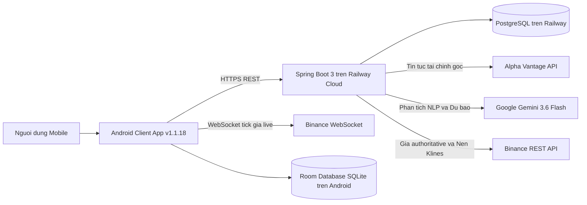
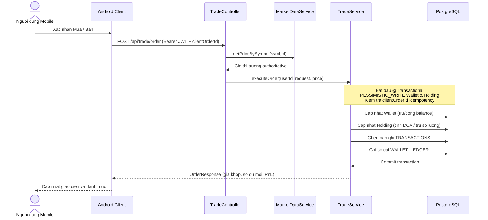

# FNMF Codebase Walkthrough — Tai lieu Kien truc va Ma nguon

Tai lieu danh cho giang vien phan bien, thanh vien nhom phat trien va ky su he thong can nam bat kien truc toan dien cua du an Financial News & Market Forecasting (FNMF) tai phien ban release v1.1.18.

Moi luong nghiep vu trong he thong deu duoc truy vet day du theo chu trinh:
1. Thao tac cua nguoi dung tren giao dien Android.
2. Endpoint REST API hoac ket noi WebSocket tuong ung.
3. Lop Controller va Service tiep nhan va dieu phoi logic nghiep vu tren Spring Boot.
4. Nguon du lieu ben ngoai (Binance, Alpha Vantage, Google Gemini) hoac co so du lieu noi bo (PostgreSQL/H2, Room DB).
5. Co che bien doi, ghi so kiem toan, bao ve toan ven va tra ve ket qua.
6. Co che phan ung, suy giam tinh nang mem deo (Graceful Degradation) khi gap su co.

---

## 1. Kien truc tong the he thong (System Architecture)

He thong FNMF duoc thiet ke theo kien truc Client-Server da tang, phan tach ro rang giua tang trinh dien di dong, tang may chu trung gian (Backend REST & AI Gateway), va cac he thong cung cap du lieu thi truong / mo hinh tri tue nhan tao.



Nguyen tac van hanh cot loi cua he thong:
- **Client Mobile (Android):** Xay dung theo mau kien truc MVVM, su dung Retrofit 2 va OkHttp 3 de giao tiep REST API qua HTTPS, mo ket noi WebSocket doc lap voi Binance de nhan tick gia live, va duy tri Room Database cuc bo lam bo nho dem ngoai tuyen.
- **Backend & AI Gateway (Spring Boot 3):** Dong vai tro la nguon su that duy nhat (Single Source of Truth) cho toan bo nghiep vu xac thuc, so du vi, danh muc tai san, lich su khop lenh va ban tin phan tich AI. He thong khong su dung gia giao dich do client tu tinh toan gui len ma xac dinh tu nguon gia authoritative cua backend.
- **Lop dich vu ben ngoai:**
  - Binance REST API (`https://api.binance.com/api/v3/klines`, ticker) phuc vu chuoi nen that lich su va gia authoritative.
  - Binance WebSocket (`wss://stream.binance.com:9443/ws/...`) phuc vu cap nhat bieu do nhat ky tren client.
  - Alpha Vantage API (`https://www.alphavantage.co/query`, ham `NEWS_SENTIMENT`) phuc vu tin tuc tai chinh thuc te.
  - Google Gemini AI (`OPENAI_DEFAULT_MODEL=gemini-3.6-flash`) ket noi qua giao thuc tuong thich OpenAI de xu ly ngon ngu tu nhien, tom tat su kien va du bao thi truong.

---

## 2. Moi truong trien khai: Railway Cloud vs Localhost IntelliJ/Hotspot (Deployment Topology)

He thong tach biet hoan toan giua moi truong phat trien cuc bo va moi truong van hanh production tren nen tang dam may:

| Dac tinh | Moi truong Local Development | Moi truong Production (Railway Cloud) |
| :--- | :--- | :--- |
| **May chu chay** | Tien trinh JVM khoi chay boi IntelliJ IDEA hoac Maven Wrapper tren laptop | Container Docker chay doc lap tren may chu Railway |
| **Co so du lieu** | H2 Database in-memory che do tuong thich PostgreSQL (`MODE=PostgreSQL`) | PostgreSQL managed database tren Railway |
| **Quan ly Schema** | Flyway Migrations (V1 den V8) tu dong chay khi khoi dong | Flyway Migrations (V1 den V8) quan ly phien ban schema chat che |
| **Dia chi truy cap** | `http://localhost:8083` (Chi truy cap duoc tu laptop hoac LAN hotspot) | `https://fnmf-backend-production.up.railway.app/` (Internet toan cau qua HTTPS) |
| **Bao mat endpoint** | Mo Swagger UI, OpenAPI spec, H2 Console phuc vu lap trinh vien | `ProductionSecurityFilter` chan hoan toan Swagger, H2 va diagnostics (tra ve HTTP 404) |
| **Quan ly Bi mat** | `application.properties` | Bien moi truong Railway (Environment Variables), 0 secrets commit vao git |

Uu diem cua kien truc Cloud Production:
- Thiet bi Android co the cai dat file APK release candidate va su dung ung dung o bat ky dau qua 4G/Wi-Fi ma khong phu thuoc vao laptop hay mang LAN noi bo.
- Du lieu vi, tai san nam giu va lich su giao dich ton tai ben vung trong PostgreSQL, khong bi mat khi tat IDE hoac dung may tinh ca nhan.

---

## 3. Xac thuc, Phan quyen & Bao mat: Auth, JWT & AndroidKeyStore AES-GCM

### 3.1. Nghiep vu Xac thuc phia Backend
1. **Dang ky tai khoan Email-only (`POST /api/auth/register`):**
   - He thong yeu cau `email`, `password`, va `fullName`.
   - Email duoc chuan hoa ve chu thuong (`LOWER(email)`).
   - Mat khau duoc ma hoa mot chieu bang `BCryptPasswordEncoder` voi do manh salt 10 vong.
   - Khi tao thanh cong nguoi dung moi, he thong tu dong tao mot vi von khoi tao $10,000.00 USD trong bang `WALLETS`.
2. **Dang nhap & Phat hanh JWT (`POST /api/auth/login`):**
   - Kiem tra mat khau qua `BCrypt.checkpw()`.
   - Phat hanh chuoi JSON Web Token (JWT) su dung thu vien JJWT, ma hoa bang thuat toan HMAC-SHA256 voi thoi han hieu luc 24 gio.
   - Payload chua thong tin `sub` (email), `userId`, va danh sach vai tro (`role`: `USER` hoac `ADMIN`).
3. **Kiem tra phien (`GET /api/auth/me`):**
   - Yeu cau header `Authorization: Bearer <token>`.
   - `JwtAuthenticationFilter` giai ma token, thiet lap `SecurityContextHolder`, va tra ve thong tin nguoi dung kem so du vi hien tai.

### 3.2. Bao mat luu tru Token tren Android voi AndroidKeyStore AES-GCM
- Android client v1.1.18 quan ly phien dang nhap tap trung thong qua `AuthSessionManager`.
- Thay vi luu plain-text JWT token vao `SharedPreferences`, ung dung su dung khoa ma hoa quan ly boi he thong **AndroidKeyStore** voi thuat toan `AES/GCM/NoPadding` (khoa 256-bit).
- Chuoi token duoc ma hoa truoc khi ghi vao file cau hinh cuc bo va duoc giai ma trong bo nho RAM khi can gan vao header HTTP cua Retrofit.
- `AuthSessionManager` quan ly trang thai dieu huong tap trung: neu server tra ve HTTP 401 Unauthorized do token het han, client tu dong xoa phien va dieu huong an toan ve man hinh dang nhap `Activity1` ma khong gay vong lap dieu huong (navigation loop).

---

## 4. Luong du lieu thi truong & Khop lenh Paper Trading (Pessimistic Locking & ACID)

### 4.1. Du lieu Thi truong Authoritative va Loai bo Du lieu Gia (Zero-Fake Policy)
- **Nguon nen lich su:** Backend goi Binance REST API (`/api/v3/klines`) lay 30 cay nen ngay that cho cac ma duoc ho tro.
- **Tick gia truc tiep:** Android mo ket noi Binance WebSocket nhan thong diep kline de cap nhat bieu do `MPAndroidChart` theo thoi gian thuc.
- **Danh muc ma hop le:** `BTCUSDT`, `ETHUSDT`, `XAUUSD` (tham chieu `PAXGUSDT`).
- **Chinh sach Symbol & Tu choi USOIL:** Ma `USOIL` va cac ma khong duoc ho tro bi tu choi voi HTTP 422 `UNSUPPORTED_SYMBOL`, khong fallback ngam ve BTC.
- **Chinh sach Khong du lieu gia:** Backend da loai bo hoan toan cac ham sinh nen toan hoc mo phong, `Math.random()` va gia hardcode. Neu mat ket noi nha cung cap va chua co cache that, he thong tra ve HTTP 503 `DATA_UNAVAILABLE`. Neu da co cache that cua chinh ma do, he thong tra ve du lieu kem co `stale=true`.

### 4.2. Khop lenh Paper Trading voi Khoa bi quan (Pessimistic Locking)
Khi nguoi dung dat lenh Mua hoac Ban (`POST /api/trade/order`):
1. Client chi gui `symbol`, `side` (`BUY` hoac `SELL`), `quantity`, va `clientOrderId` (UUID). Client khong truyen gia khop ma backend xac dinh truc tiep tu thi truong.
2. `TradeController` yeu cau `MarketDataService` lay gia thi truong thoi gian thuc authoritative truc tiep tu Binance.
3. `TradeService.executeOrder()` duoc thuc thi ben trong transaction co tinh toan ven ACID (`@Transactional`):
   - Ap dung khoa bi quan `@Lock(LockModeType.PESSIMISTIC_WRITE)` len ban ghi `Wallet` cua nguoi dung de tranh race condition khi co nhieu lenh gui cung luc.
   - Ap dung khoa bi quan `@Lock(LockModeType.PESSIMISTIC_WRITE)` len ban ghi `Holding` tuong ung voi ma tai san.
   - Kiem tra so du kha dung: Lenh BUY kiem tra so du tien mat du chi tra; lenh SELL kiem tra so luong tai san dang nam giu du de ban.
   - Cong thuc tinh gia von binh quan (DCA) khi Mua:
     $$\text{AvgBuyPrice}_{\text{new}} = \frac{(\text{AvgBuyPrice}_{\text{old}} \times \text{Quantity}_{\text{old}}) + (\text{Price}_{\text{exec}} \times \text{Quantity}_{\text{new}})}{\text{Quantity}_{\text{old}} + \text{Quantity}_{\text{new}}}$$
   - Tinh Loi/Lo (PnL) thoi gian thuc:
     $$\text{PnL} = (\text{CurrentPrice} - \text{AvgBuyPrice}) \times \text{Quantity}$$
   - Ghi nhan ban ghi vao bang `TRANSACTIONS` kem `clientOrderId`.
   - Ghi nhan bien dong so du vao so cai kiem toan `WALLET_LEDGER`.
4. **Bao dam tinh luy thua (Idempotency):** Neu backend nhan lai cung mot `clientOrderId`, he thong phat hien ban ghi da ton tai trong `TRANSACTIONS` va replay ngay ket qua khop lenh cu ma khong tru tien hay cap nhat so du lan thu hai.



---

## 5. Luồng Dự báo Thị trường AI (Market Forecast via Gemini 3.6 Flash & Quota Protection)

### 5.1. Kiến trúc Pipeline Dự báo AI
Endpoint: `GET /api/forecast/{symbol}?timeframe=24H_7D` và `POST /api/forecast/analyze`.

1. **Thu thập nguồn dữ liệu đa chiều:**
   - 30 cây nến kỹ thuật OHLCV gần nhất từ Binance REST thông qua `MarketDataService`.
   - Tin tức vĩ mô và tâm lý thị trường mới nhất trong bộ nhớ đệm `NEWS_AI_CACHE`.
2. **Điều phối luồng và xây dựng Prompt chuyên gia:**
   - `ForecastService` đóng vai trò điều phối: kiểm tra tính khả dụng của giá thị trường thời gian thực, kiểm tra bản ghi hợp lệ trong `ForecastCacheService`, thu thập chuỗi nến và tin tức, chuyển dữ liệu cho `GeminiForecastClient` và kiểm duyệt đầu ra qua `ForecastQualityPolicy`.
   - System prompt được đóng gói bên trong `GeminiForecastClient.java` (không nằm trong `ForecastService.java`), yêu cầu mô hình Google Gemini (`gemini-3.6-flash`) phân tích chuỗi nến thực tế kết hợp tin tức vĩ mô.
   - Mô hình đánh giá: Xu hướng (`trendPrediction`: `BULLISH_UPTREND`, `BEARISH_DOWNTREND`, `SIDEWAYS_CONSOLIDATION`), vùng hỗ trợ kỹ thuật (`supportLevel`), vùng kháng cự kỹ thuật (`resistanceLevel`), khuyến nghị hành động (`recommendation`: `STRONG_BUY`, `BUY`, `HOLD`, `SELL`, `STRONG_SELL`), điểm tin cậy (`confidenceScore` từ 0 đến 100).
   - Định dạng đầu ra yêu cầu JSON thuần túy, không bọc markdown backticks.
   - Giới hạn nội dung hiển thị tiếng Việt ngắn gọn:
     - `technicalOutlook`: đúng 1 câu tiếng Việt, tối đa 140 ký tự.
     - `fundamentalOutlook`: đúng 1 câu tiếng Việt, tối đa 140 ký tự.
     - `keyDrivers`: đúng 3 ý; mỗi ý là 1 câu tiếng Việt, tối đa 85 ký tự.
3. **Quản lý Cache 15 phút trong PostgreSQL:**
   - Kết quả dự báo được lưu vào bảng `MARKET_FORECASTS` với thời hạn hiệu lực 15 phút.
   - Các yêu cầu tiếp theo trong vòng 15 phút được phục vụ trực tiếp từ CSDL (`fromCache: true`), tiết kiệm lượt gọi AI và phản hồi nhanh chóng.
   - `ForecastCacheService` chỉ chấp nhận các bản ghi có nguồn phân tích `analysisSource = "GEMINI"`.
4. **Lưu vết nguồn phân tích và xử lý sự cố (Flyway V8):**
   - Bản ghi lưu vết nguồn phân tích tại cột `analysis_source` với giá trị chuẩn là `GEMINI`, kèm số lượng nến thực tế tại cột `candle_count`.
   - Hệ thống không sử dụng dữ liệu giả hay mô hình dự phòng tự tạo. Khi Gemini hoặc cache hợp lệ không khả dụng, endpoint ném `ForecastUnavailableException` và trả về HTTP 503 với mã lỗi `FORECAST_UNAVAILABLE`.

---

## 6. Luong Tin tuc Tai chinh & Pipeline AI Sentiment (Alpha Vantage -> Gemini -> PostgreSQL/Room DB)

### 6.1. Pipeline xu ly tin tuc tu dong
Endpoint: `GET /api/news/sync?limit=5` va `GET /api/news/feed?limit=5`.

Luong du lieu:
$$\text{Alpha Vantage (NEWS\_SENTIMENT)} \longrightarrow \text{Google Gemini 3.6 Flash} \longrightarrow \text{PostgreSQL NEWS\_AI\_CACHE} \longrightarrow \text{Android Room DB}$$

Cac buoc thuc hien:
1. **Fetch tin tuc goc:** `AiNewsService` goi Alpha Vantage REST API voi `function=NEWS_SENTIMENT`, lay danh sach bai bao tai chinh quoc te gan nhat.
2. **Kiem tra Cache theo URL:** Moi bai bao duoc nhan dien duy nhat bang `articleUrl`. Neu bai bao da ton tai trong bang `NEWS_AI_CACHE` va da co ban dich / phan tich hop le, backend su dung lai ket qua cache.
3. **Phan tich bang Gemini AI:** Neu la bai bao moi, backend trich xuat tieu de va ban tom tat goc truyen sang Gemini qua OpenAI-compatible endpoint. System prompt yeu cau:
   - Dich tieu de sang tieng Viet tu nhien.
   - Tom tat noi dung cot loi thanh 2 den 4 gach dau dong (bullet points) su kien that.
   - Xac dinh nhan tam ly (`BULLISH`, `BEARISH`, `NEUTRAL`), diem tin cay (`confidencePct`), va ly do danh gia (`reason`).
4. **Luu tru CSDL & Dong bo Room DB:** Ket qua duoc luu vao `NEWS_AI_CACHE`. Android client nhan du lieu va tu dong upsert vao Room Database cuc bo de ho tro xem offline khi mat ket noi.

### 6.2. Cơ chế điều phối Single-Flight và Graceful Degradation
- **AlphaNewsCoordinator:** Sử dụng khóa `refreshLock` bao phủ toàn bộ pipeline để ngăn ngừa tình trạng nhiều client gửi yêu cầu đồng thời làm quá tải kết nối tới Alpha Vantage.
- **Xử lý giới hạn tần suất HTTP 429:** Khi Gemini phản hồi mã lỗi HTTP 429 (`GeminiRateLimitException`), `AiNewsService` lập tức ngắt vòng lặp (`break`), không gửi tiếp các bài báo còn lại để bảo vệ hạn ngạch dịch vụ AI cho Forecast, đồng thời kích hoạt trạng thái cooldown cho Gemini thông qua `alphaNewsCoordinator.recordGeminiFailure()`.
- **Cơ chế Cooldown và tái sử dụng Snapshot:** Khi snapshot tin tức thô từ Alpha Vantage đã có trong RAM, nếu Gemini đang trong thời gian cooldown thì hệ thống ưu tiên phục vụ dữ liệu đã lưu trong cơ sở dữ liệu (`fromCache: true`) hoặc trả trạng thái degraded; khi hết cooldown, hệ thống tái sử dụng snapshot thô trong RAM để xử lý qua Gemini mà không cần gọi lại Alpha Vantage.
- **Nguyên tắc an toàn dữ liệu:** Hệ thống không tự tạo dữ liệu giả mạo. Nếu không có tin tức mới hoặc dịch vụ gặp sự cố, hệ thống trả về trạng thái `empty` hoặc `degraded` một cách minh bạch, không ghi log thông tin bí mật hay nội dung phản hồi thô của nhà cung cấp.

---

## 7. Luong Quan ly Danh muc theo doi (Watchlist Cloud CRUD & Room Sync)

- **Cloud CRUD:** Ho tro day du cac thao tac ca nhan hoa:
  - `GET /api/watchlist`: Lay danh muc cua nguoi dung hien tai (xac thuc qua Bearer JWT), tu dong lam giau voi gia thi truong thoi gian thuc va ty le bien dong 24h.
  - `GET /api/watchlist/ai-insights`: Quet toan bo cac ma trong Watchlist de tong hop nhan dinh AI va tin tuc lien quan.
  - `POST /api/watchlist`: Them ma vao danh muc theo doi, kiem tra chong trung lap.
  - `DELETE /api/watchlist/{symbol}`: Xoa ma khoi danh muc.
- **Phan lap du lieu theo User:** Danh muc theo doi duoc luu trong bang `WATCHLISTS` voi khoa ngoai `user_id`. Phia Android, Room DB luu tru cache watchlist phan tach theo `userEmail`, bao dam khi doi tai khoan tren cung mot thiet bi khong bi tron lan du lieu.

---

## 8. Quan ly Vi & So cai bien dong so du (Wallet & Append-Only Ledger)

- **Von khoi tao ban dau:** Moi tai khoan dang ky moi duoc cap tu dong mot vi trong bang `WALLETS` voi `balance_usd = 10000.00` va `initial_balance = 10000.00`.
- **So cai bien dong so du don (Single-Entry Append-Only Ledger):**
  - Bang `WALLET_LEDGER` luu tru lich su bat bien cua moi giao dich lam thay doi so du vi.
  - Cac loai bien dong (`entry_type`):
    - `DEPOSIT`: Nap tien Sandbox.
    - `WITHDRAWAL`: Rut tien Sandbox.
    - `TRADE_BUY`: Khau tru tien de mua tai san Paper Trading.
    - `TRADE_SELL`: Cong tien thu duoc tu lenh ban tai san Paper Trading.
    - `ADMIN_ADJUSTMENT`: Dieu chinh so du boi quan tri vien.
  - Moi dong so cai luu giu: `wallet_id`, `entry_type`, `amount_usd`, `balance_before`, `balance_after`, `reference_id`, `description`, va `created_at`.
  - He thong khong tuyen bo sai la ke toan kep (double-entry), ma ap dung mo hinh so cai kiem toan don bat bien chuan muc cho he thong vi nguoi dung.

---

## 9. Cong Thanh toan Sandbox & Nap/Rut tien (Simulated Banking Architecture / VNPay Sandbox)

### 9.1. Dinh vi kien truc va Chinh sach Zero-Risk
Module Nap/Rut tien duoc thiet ke de minh hoa kien truc Payment Gateway va Core Banking trong do an:
- **Chinh sach Zero-Risk:** Toan bo nguon tien la USD mo phong (Sandbox). He thong khong tich hop cong the tin dung that, khong luu tru thong tin nhay cam (so the, CVV, OTP).
- **Kien truc Provider-Neutral:** Tach biet ro giua tang nghiep vu (`PaymentService`), tang dinh tuyen (`PaymentProviderRegistry`), va nha cung cap mo phong noi bo (`InternalSandboxPaymentProvider` voi ma cau hinh `SANDBOX_INTERNAL`).
- **Hosted Checkout Simulation:** Khi tao don nap hoac rut tien, backend sinh mot `checkoutToken` duy nhat kem `expiresAt` (+15 phut) va tra ve `checkoutUrl`. Android mo giao dien thanh toan qua Chrome Custom Tabs hoac trinh duyet ngoai.

### 9.2. May trang thai Don hang (Order State Machine) va Het han 15 phut
```
[PENDING] (Khoi tao don, cho thanh toan, han 15 phut)
    |
    +---> [PROCESSING] (Bat dau xu ly tren giao dien web)
    |         |
    |         +---> [SUCCEEDED] (Xac nhan thanh cong -> PESSIMISTIC LOCK -> Cap nhat vi -> Ghi WALLET_LEDGER)
    |         |
    |         +---> [FAILED] (Tu choi / Loi / Het han 15 phut -> Tra HTTP 410 GONE)
    |
    +---> [CANCELLED] (Nguoi dung chu dong huy don)
```

- **Quy tac rang buoc scale so tien:** So tien nap/rut bat buoc phai co scale <= 2 (vi du: `$500.00` hoac `$120.50`), khong vuot qua han muc `$100,000.00` USD mot lan.
- **Kiem soat het han 15 phut:** Moi truy cap giao dien hosted checkout hoac xu ly thanh toan sau khi da qua moc `expiresAt` deu bi tu choi voi ma HTTP 410 `GONE`, dong thoi chuyen trang thai don hang thanh `FAILED`.
- **Tuan thu CSP tren Railway:** Giao dien Hosted Checkout khong dung inline script hoac inline style, su dung cac file asset rieng biet `/sandbox-checkout.css` va `/sandbox-checkout.js` tuan thu chinh sach Content Security Policy.

---

## 10. Co so du lieu, Flyway Migrations (V1 den V8) & Quan ly Schema

Toan bo co so du lieu PostgreSQL tren Railway duoc quan ly phien ban chat che bang Flyway Migrations tu V1 den V8:

1. `V1__init_schema.sql`: Khoi tao 7 bang ban dau (`users`, `wallets`, `holdings`, `transactions`, `watchlists`, `news_ai_cache`, `market_forecasts`).
2. `V2__normalize_and_enforce_user_email.sql`: Chuan hoa mo hinh email-only, xoa cot username, bo sung rang buoc duy nhat `LOWER(email)`.
3. `V3__holding_unique_constraint_and_client_order_id.sql`: Bo sung rang buoc duy nhat `UNIQUE (wallet_id, symbol)` va cot `client_order_id` trong `transactions`.
4. `V4__add_payment_orders_and_checkout_token.sql`: Khoi tao bang `payment_orders` voi cac truong token checkout, loai don, so tien va trang thai.
5. `V5__add_wallet_ledger_audit.sql`: Khoi tao bang so cai kiem toan `wallet_ledger` luu tru bien dong so du bat bien.
6. `V6__add_payment_events_and_scale_guards.sql`: Khoi tao bang `payment_events` luu vet su kien thanh toan va rang buoc scale so tien.
7. `V7__harden_payment_flow_and_order_indexes.sql`: Bo sung chi muc cho `payment_orders` (`expires_at`, `checkout_token`) va kiem soat qua han.
8. `V8__add_forecast_source_and_metadata.sql`: Bo sung 2 cot `analysis_source` (VARCHAR(50)) va `candle_count` (INTEGER) vao bang `market_forecasts` de luu vet nguon phan tich AI (gia tri chuan: `GEMINI`) va so luong nen ky thuat thuc te duoc phan tich.

---

## 11. Vong doi ung dung, Tinh luy thua (Idempotency) & Nguon su that duy nhat (SSOT)

### 11.1. Quan ly Vong doi tren Android Client
- Cac Fragment (`ForecastFragment`, `NewsFeedFragment`, `WalletProfileFragment`, `TradingFragment`) deu tuan thu ngat nghe quy tac huy Retrofit `Call` hoac coroutine job ben trong `onDestroyView()`.
- Ngan ngua ro ri bo nho (memory leak) va khong bao gio cap nhat UI sau khi view da bi tieu huy.
- `PaymentIdempotencyManager` luu tru khoa `clientRequestId` trong `Bundle` va `SharedPreferences`, bao toan khoa khi xoay man hinh hoac khi he dieu hanh thu hoi tien trinh (process death).

### 11.2. Tinh luy thua (Idempotency)
- **Paper Trading:** Su dung `clientOrderId` (UUID). Replay ket qua neu nhan trung lenh.
- **Sandbox Payment:** Su dung `clientRequestId` (UUID) co rang buoc duy nhat trong bang `payment_orders`. Neu client gui lai cung mot request ID voi cung so tien, server tra ve don hang hien tai; neu doi so tien, server tra ve HTTP 409 Conflict.

### 11.3. Nguon su that duy nhat (Single Source of Truth)
- Server Backend la nguon su that duy nhat cho: so du vi, danh muc nam giu, gia authoritative khop lenh, du bao AI va lich su giao dich.
- Room Database tren thiet bi Android chi dong vai tro bo nho dem ngoai tuyen (offline cache), khong bao gio tu sinh du lieu thay the server.

---

## 12. Danh gia Kiem thu, Gioi han ky thuat & Huong phat trien (Test Tiers & Known Limitations)

### 12.1. Cac tang Kiem thu trong Du an (Test Tiers)
He thong FNMF ap dung cac lop kiem thu ro rang, khong danh dong giua cac tang:
1. **Backend Unit & Integration Tests (184 test pass hoan toan):**
   - Kiem thu logic khop lenh, khoa bi quan, chong am vi, cong thuc DCA va PnL.
   - Kiem thu bao ve toan ven du bao AI, chinh sach chat luong Forecast, va xu ly khi Gemini khong kha dung (HTTP 503 FORECAST_UNAVAILABLE).
   - Kiem thu pipeline News AI, single-flight coordinator, va cache PostgreSQL.
   - Kiem thu module Payment Sandbox, so cai `wallet_ledger`, kiem soat het han 15 phut va idempotency.
2. **Android Unit Tests (Chay cuc bo tren JVM):**
   - Kiem thu Parser, Model DTO, Formatter, hop dong ApiService, va logic Idempotency Manager.
3. **Android Connected Instrumented Tests (10 test tren thiet bi that Samsung):**
   - 9 test nghiep vu bao mat va migration: ma hoa AndroidKeyStore AES-GCM, SQLite/Room migration, luu tru phien an toan.
   - 1 test `ExampleInstrumentedTest` kiem tra application context.
4. **Manual Smoke Checklist:**
   - Kiem tra thu cong tren thiet bi that Samsung cho toan bo cac tinh nang: Khoi dong, Dang nhap, Trading/WebSocket, Du bao AI, Tin tuc AI, Watchlist, Vi va Deep Link.

### 12.2. Gioi han ky thuat hien tai (Known Limitations)
1. **Nguon du lieu Dau tho WTI (USOIL):** Cac nha cung cap du lieu hang hoa phai sinh WTI Spot thoi gian thuc yeu cau chi phi ban quyen lon. Du an tam hoan ho tro ma dau tho va tu choi an toan voi HTTP 422 `UNSUPPORTED_SYMBOL` thay vi dung gia gia mo phong.
2. **Dong tien co so don nhat:** Toan bo he thong dinh gia, tinh toan so du vi va khop lenh theo dong USD/USDT, chua ho tro da vi ngoai te fiat (VND, EUR).
3. **Giao dich va Thanh toan mo phong:** Paper Trading va Sandbox Banking duoc thiet ke cho muc tieu nghien cuu va hoc tap, khong giao dich tien that tren san thuc te.

---

## 13. Hotfix sau phát hành v1.1.18

Sau khi phát hành phiên bản v1.1.18, hệ thống backend đã thực hiện các bản sửa lỗi (hotfix) để tối ưu hóa hiển thị trên giao diện Android và bảo vệ hạn ngạch dịch vụ AI:
- Commit `20b25a1`: Rút gọn nội dung Forecast. Giới hạn độ dài nhận định kỹ thuật (`technicalOutlook` tối đa 140 ký tự), nhận định cơ bản (`fundamentalOutlook` tối đa 140 ký tự) và đúng 3 yếu tố dẫn dắt chính (`keyDrivers`, mỗi ý tối đa 85 ký tự) nhằm bảo đảm hiển thị vừa vặn trên giao diện ứng dụng di động Android.
- Commit `3dffc56`: Làm sạch thông báo lỗi và log provider. Loại bỏ nội dung lỗi thô và chi tiết phản hồi từ nhà cung cấp khỏi nhật ký máy chủ, chuẩn hóa mã lỗi trả về cho client (`FORECAST_UNAVAILABLE`).
- Commit `527e455`: Ngừng vòng xử lý News khi Gemini trả 429. Bổ sung cơ chế phát hiện mã lỗi HTTP 429 từ Gemini API để lập tức dừng vòng lặp (`break`), kích hoạt thời gian chờ (cooldown) và ưu tiên phục vụ dữ liệu đã lưu trong cơ sở dữ liệu để bảo vệ hạn ngạch cho Forecast.
